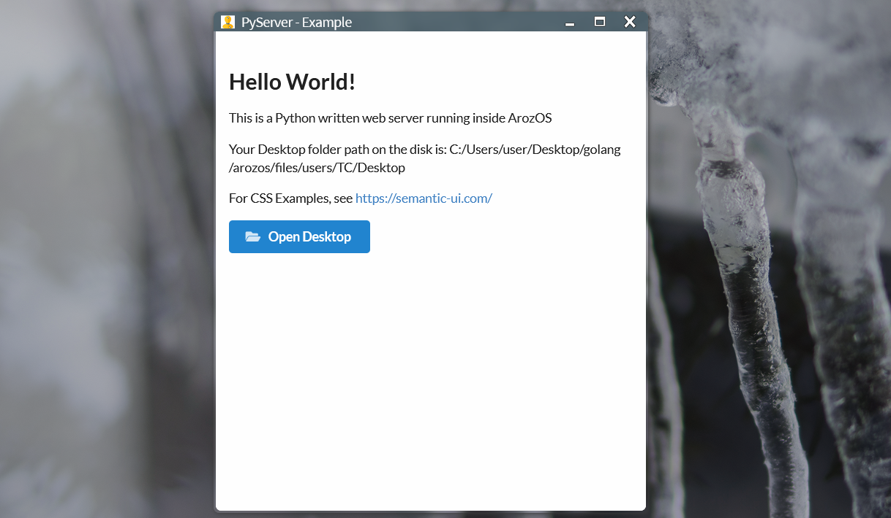

# PyServer

PyServer is a basic example showcasing the method for bridging Python written web application into ArozOS with a bash script and a few flag files.

### Requirement

- ArozOS 1.117 or above
- Python 3.7 or above
- Windows or Linux with bash (Recommend: Debian)

### Installation

1. Create a new folder inside arozos/subservices named "PyServer"
2. Drag and drop all the files into the newly created PyServer folder
3. Restart arozos

